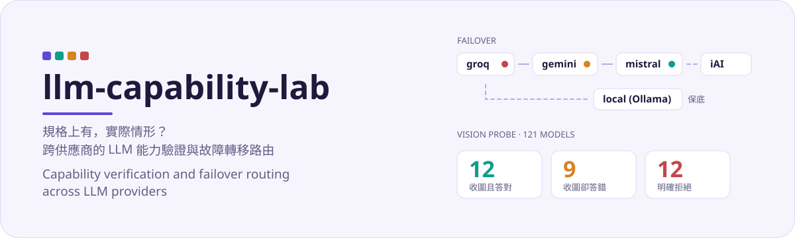

<div align="center">
  <a href="#readme"></a>
  <a href="docs/README.en.md"></a>
</div>

<div align="center">
  
</div>

<h1 align="center">llm-capability-lab</h1>

<div align="center">
  <strong>規格上有，實際情形？</strong><br>
  跨供應商的 LLM 能力驗證與故障轉移路由。
</div>

<div align="center">
  
  
  
  
  
</div>

<div align="center">
  <a href="#功能">功能</a> ·
  <a href="#安裝">安裝</a> ·
  <a href="#快速入門">快速入門</a> ·
  <a href="#文件">文件</a> ·
  <a href="#貢獻">貢獻</a> ·
  <a href="#授權">授權</a>
</div>

---

## 功能

同一份 provider 註冊表，三種用法：

| | 進入點 |
|---|---|
| Python 函式庫 | `import llmclab` |
| HTTP 服務 | `llmclab serve` |
| 研究工作台 | `llmclab vision-menu` |

故障轉移順序：同一家的金鑰槽先用完，再換下一家，最後才打本機端點（若有啟用）。

- **`429` / `5xx` / timeout** — 同一把先重試（優先聽 `Retry-After`），次數用完換下一把
- **`401` / `403`** — 這把金鑰無效，立刻換下一把
- **`400`** — 請求本身有問題，跳過這家
- **全掛** — 拋 `AllProvidersFailed`，`.attempts` 留下每一次嘗試

內建 Groq、Gemini、Mistral、可選的機構端點，以及本機 [Ollama](https://ollama.com)。雲端請求走 Chat Completions（`/v1/chat/completions`）；本機 Ollama 走官方 `/api/chat`。HTTP 服務的 `/docs` 是 [OpenAPI Specification](https://spec.openapis.org/oas/latest.html)（OAS），與 Chat Completions、與 OpenAI 公司無關。用語見 [文件索引](docs/README.md#名詞)。

測試 **82** 項：不呼叫外網、不需供應商金鑰。部分案例會在本機起 HTTP 伺服器，走真實的 `openai` 套件與 FastAPI 路由。

---

## 安裝

需要 Python 3.10+。

```bash
pip install "git+https://github.com/Lrniey666/llm-capability-lab.git"
pip install "git+https://github.com/Lrniey666/llm-capability-lab.git[serve]"
```

從原始碼開發：

```bash
git clone https://github.com/Lrniey666/llm-capability-lab.git
cd llm-capability-lab
pip install -e ".[serve,dev]"
```

把 `.env.example` 複製成 `.env`，填入要用的供應商金鑰。沒填的 provider 會被跳過，不會在匯入時失敗。申請入口見各家控制台；金鑰槽命名為 `GROQ_API_KEY`、`GROQ_API_KEY2`…（最多到 `KEY9`）。本機保底需另設 `LOCAL_BASE_URL`。

研究模組（視覺評測、對照實驗）需要原始碼 checkout 裡的 `menu_example/` 與 `docs/`。套件裝在別處時設 `LLMCLAB_WORKSPACE` 指回 repo。

---

## 快速入門

### 函式

| 函式 | 作用 |
|---|---|
| `llmclab.ask(prompt, *, system=None, **kwargs)` | 送一句話；失敗時輪替金鑰與供應商 |
| `llmclab.Router.from_env(...)` | 依環境變數建立路由器 |
| `Router.chat(messages, **kwargs)` | 同步對話 |
| `await Router.achat(messages, **kwargs)` | 非同步；阻塞 I/O 不跑在 event loop 執行緒 |
| `llmclab.default_router()` / `reset_default_router()` | 行程內快取的 Router |

回傳 `ChatResult`（`.text`、`.provider`、`.model`、`.rate_limit`、`.attempts`）。全部失敗時拋 `AllProvidersFailed`。完整清單見 `llmclab.__all__`。

```python
import llmclab

result = llmclab.ask("用一句話解釋 RAG")
print(result.text, "via", result.provider)
```

```python
from llmclab import Router

router = Router.from_env(retries_per_key=1, timeout=45)
result = router.chat([{"role": "user", "content": "你好"}])
print(result.provider, result.rate_limit.summary())
```

```python
result = await router.achat(messages, max_tokens=500)
```

### HTTP

```bash
export LLMCLAB_API_TOKEN=$(python -c "import secrets; print(secrets.token_urlsafe(32))")
llmclab serve --port 8000
```

```bash
curl -X POST http://127.0.0.1:8000/v1/chat \
  -H "Authorization: Bearer $LLMCLAB_API_TOKEN" \
  -H "Content-Type: application/json" \
  -d '{"prompt": "用一句話解釋 RAG"}'
```

互動規格在服務的 `/docs`（OAS）。端點說明見 [`docs/http-api.md`](docs/http-api.md)。

### CLI

```bash
llmclab keys
llmclab models
llmclab ask groq "你好"
llmclab fallback "你好"
llmclab vision-menu --phase core
```

---

## 文件

| | |
|---|---|
| [文件索引](docs/README.md) | 名詞、架構、HTTP、實驗協議 |
| [架構](docs/architecture.md) | 分層、轉移順序、如何加 provider |
| [HTTP API](docs/http-api.md) | `/v1/chat`、`/v1/menu`、授權 |
| [發現](docs/findings.md) | 型錄能力與視覺抽取評測結論 |
| [實驗協議](docs/vision-menu/protocol.md) | 刺激集、探針、規則式評分 |

---

## 貢獻

歡迎 issue 與 PR。送 PR 前請跑 `pytest`，並看 [CONTRIBUTING.md](CONTRIBUTING.md)。

新增供應商通常只改 `llmclab/config.py` 的 `PROVIDERS`。對方需要提供 Chat Completions HTTP 介面。

---

## 授權

程式碼：[MIT](LICENSE)。

`docs/vision-menu/` 的實驗資料與報告：[CC BY 4.0](https://creativecommons.org/licenses/by/4.0/)。

`menu_example/` 為公開張貼菜單與 App 截圖，僅作評測刺激集。
